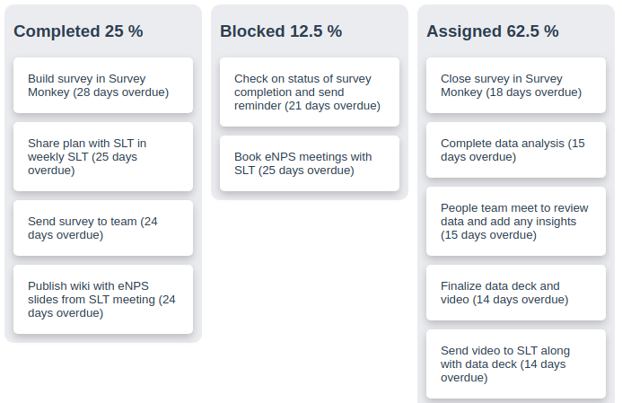

# Simple Frontend with Vue

Used Vue.js to display data from an API end point.

## Project setup

    npm install
    npm run serve

## Docker run

    docker run -p 8080:8080 -d drianthoderyme/simple-frontend-vue

Then go to https://localhost:8080

## Docker dev

    docker build -t drianthoderyme/simple-frontend-vue .
    docker push drianthoderyme/simple-frontend-vue

## TODO

High priority

* to split up my Vue code in multiple components
* clicking on a card shows a popup with an X to kill it or click away to kill it
* for each author, show icon and be able to click icon to only see tickets assigned to that icon
* use a search input box to filter for any task fields

Medium priority

* convert from js to typescript
* convert html to pug

Low priority

* use gRPC proto for /v1/tasks api endpoint
* instead of using the odd `vue.config.js` to serve the tasks, have a separate backend server do it
